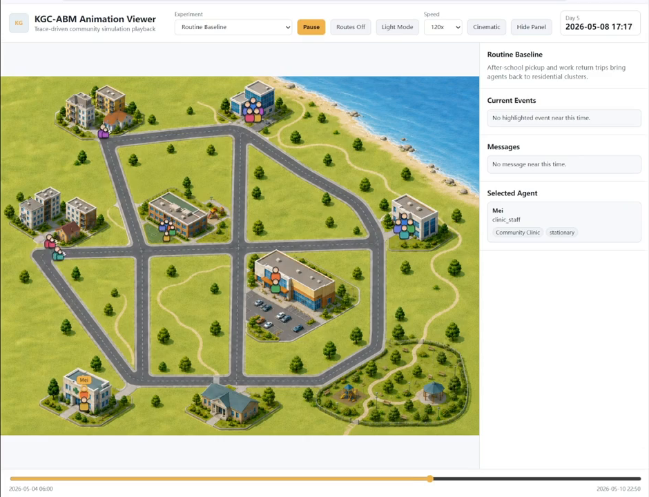

# KGC-ABM


> [!IMPORTANT]
> **Peer-review access notice:** This public repository provides a complete
> project overview and demonstration snapshot prepared for peer review. The
> complete source code and supporting data are distributed through the private
> Zenodo review package. Reviewers should use the Zenodo link provided in the
> **Cover Letter** to access and download the complete source code and data.
> Following acceptance, the complete source code will be added to this
> repository, and the supporting data will be made publicly available through
> Zenodo.

KGC-ABM is a knowledge-graph-centered framework for constructing and running
agent-based simulations with evolving world state, agent-specific perspectives,
event-driven interactions, and inspectable execution histories.



*The Animation Viewer playing a routine community simulation.*

## What KGC-ABM Provides

- Graph-centered representation of agents, places, routes, tasks, events,
  information, beliefs, relationships, and evolving simulation state.
- Event-driven simulation scenarios with checkpoints and branches from a shared
  state.
- Configurable agent runtimes with heuristic, mock, and OpenAI-compatible modes.
- Structured summaries, checkpoints, traces, diagnostics, and Neo4j-compatible
  graph exports.
- A browser-based Animation Viewer for inspecting movement, route conditions,
  events, communication, and changing agent state.

## Demonstrated Scenarios

| Scenario | Description |
|---|---|
| Routine Baseline | Seven days of household routines, travel, work, school, and caregiving. |
| Branch A: Route Disruption | Changed travel conditions and the resulting community response. |
| Branch B: Caregiver Handoff | Caregiving coordination after an assigned caregiver becomes unavailable. |
| Branch C: Public Claim Confirmation | Information exchange and response to a formally confirmed claim. |

These scenarios are presented as a routine baseline followed by event-driven
branches. The branches illustrate how a shared simulated environment can
evolve under changes in mobility, availability, and public information.

## Demonstration Videos

### Routine Baseline

Routine activity across the seven-day community simulation.

https://github.com/user-attachments/assets/b4821a9f-2339-42fe-8b2d-159821f7eff9

### Branch A: Route Disruption

Agent movement and community activity after a route disruption.

https://github.com/user-attachments/assets/144423a2-2b4b-40d8-afac-790a372be315

### Branch B: Caregiver Handoff

Coordination after the scheduled caregiver becomes unavailable.

https://github.com/user-attachments/assets/2eb8aec9-2b24-4d56-9b88-98a2321fe274

### Branch C: Public Claim Confirmation

Communication and response to a formally confirmed claim.

https://github.com/user-attachments/assets/bbf83ffb-c261-4f65-bb86-1366d0bf6fa7

## Project Structure

The complete project release is organized around the following components:

```text
src/kgc_abm/       Core simulation package
configs/           Scenario and runtime configurations
data/scenarios/    Community scenario definitions
examples/          Scenario, checkpoint, interview, and graph examples
viewer/            Animation Viewer, playback tools, and bundle builders
docs/              Architecture, schema, output, and export references
tests/             Core regression and packaging tests
```

The current public snapshot intentionally contains only the project overview,
visual material, and licensing information. The complete implementation and
the files listed above are available in the private Zenodo review package
through the link in the **Cover Letter**.

## Simulation and Inspection

The full implementation supports a routine baseline and event branches from
serializable checkpoints. A completed run can provide:

- run summaries and graph statistics;
- resumable checkpoints;
- time-ordered activity, movement, belief, coordination, maintenance, and
  graph-evolution traces;
- aggregated diagnostics and graph exports;
- compact playback bundles for the Animation Viewer.

The Viewer presents four prepared scenarios with manual playback, speed control,
timeline scrubbing, route overlays, themes, and agent inspection. The videos
above provide the public demonstration during peer review; the Viewer source
and complete playback tools are included in the Zenodo source package.

## Full Release Access

During peer review, the complete source code and supporting data are available
through the private Zenodo review package. The access link is intentionally
provided through the **Cover Letter** rather than published here.

After acceptance:

1. The complete source code will be added to this repository.
2. The supporting data will be released through the corresponding Zenodo
   record.
3. This README will be updated from the review snapshot to the full public
   release documentation.
4. The repository URL will remain unchanged.

## License

Project materials are provided under the terms in [LICENSE](LICENSE), with
additional attribution information in [NOTICE](NOTICE).
